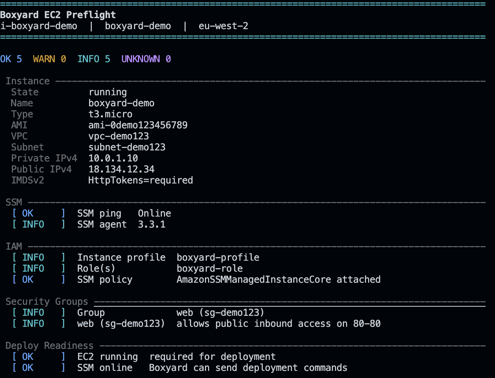

# Boxyard

Boxyard is a small `uv`-based Python CLI for working with Docker images,
containers, networks, and simple EC2 deployments.

Boxyard uses **presets** as shortcuts for Docker images. For example, the
`redis` preset maps to the `redis:latest` Docker image. When you launch that
preset, Docker creates a **container**, which is the running instance of the
image.

## Capabilities

- Launch containers from preset image shortcuts such as `sqlite`, `postgres`, `redis`, `nginx`, `mysql`, and `mongo`
- Launch multiple image presets in one command
- Attach containers to Docker networks so running containers can talk by container name
- Manage containers: list, logs, start, stop, restart, and remove
- Manage Docker networks: list, create, connect, disconnect, and remove
- Inspect EC2 deployment readiness with a terminal dashboard
- Deploy a Docker image to EC2 through AWS Systems Manager, without SSH

## Preview



## Requirements

- Python 3.10+
- `uv`
- Docker installed and running for local Docker commands
- AWS CLI for AWS commands

Install `uv` if needed:

```bash
curl -LsSf https://astral.sh/uv/install.sh | sh
```

## Set Up

From this project folder:

```bash
uv sync
```

Run commands through `uv`:

```bash
uv run docker-launch --list
uv run docker-launch sqlite
uv run docker-manager list --all
```

Or activate the virtual environment:

```bash
source .venv/bin/activate
docker-launch --list
docker-manager list --all
deactivate
```

## Presets and Images

Boxyard presets are short names for Docker images:

```text
sqlite    -> keinos/sqlite3:latest
postgres  -> postgres:latest
redis     -> redis:latest
nginx     -> nginx:latest
mysql     -> mysql:latest
mariadb   -> mariadb:latest
mongo     -> mongo:latest
alpine    -> alpine:latest
ubuntu    -> ubuntu:latest
```

List the presets:

```bash
uv run docker-launch --list
```

Launch a container from a preset:

```bash
uv run docker-launch redis
```

Preview the Docker command without creating a container:

```bash
uv run docker-launch redis --dry-run
```

## Launch Containers

Launch containers from preset images:

```bash
uv run docker-launch sqlite
uv run docker-launch nginx
uv run docker-launch redis
uv run docker-launch postgres
uv run docker-launch mysql
uv run docker-launch mongo
```

Use explicit container settings:

```bash
uv run docker-launch nginx --name web -p 8080:80
uv run docker-launch postgres --name db -e POSTGRES_PASSWORD=secret
uv run docker-launch redis --name cache -p 6380:6379
uv run docker-launch sqlite --name local-sqlite -v ./my-db:/data
```

Anything after `--` is passed to the container:

```bash
uv run docker-launch alpine --name box -- sh -lc "echo hello"
```

## Launch Multiple Presets

Launch one container for each preset:

```bash
uv run docker-launch postgres redis nginx --network boxyard-net --create-network
```

This launches containers named:

```text
postgres
redis
nginx
```

Use a prefix for grouped launches:

```bash
uv run docker-launch postgres redis nginx --name-prefix app --network boxyard-net
```

This launches:

```text
app-postgres
app-redis
app-nginx
```

For multi-preset launches, shared options like `--network` apply to all
containers. Per-container options such as `--name`, `--port`, `--env`,
`--volume`, `--image`, and custom commands are for single-container launches.

## Docker Networking

Containers on the same user-created Docker network can resolve each other by
container name.

```bash
uv run docker-manager network create boxyard-net
uv run docker-launch postgres --name db --network boxyard-net
uv run docker-launch redis --name cache --network boxyard-net
uv run docker-launch alpine --name app --network boxyard-net
```

Inside the `app` container, the running containers are reachable at:

```text
db:5432
cache:6379
```

Manage networks:

```bash
uv run docker-manager network list
uv run docker-manager network create boxyard-net
uv run docker-manager network connect boxyard-net web api worker
uv run docker-manager network disconnect boxyard-net worker
uv run docker-manager network remove boxyard-net
```

## SQLite Example

The `sqlite` preset maps to the `keinos/sqlite3:latest` image.

```bash
uv run docker-launch sqlite
```

Boxyard runs a container named `sqlite` and mounts `./sqlite-data` into the
container at `/data`:

```bash
docker run --detach --name sqlite --volume ./sqlite-data:/data keinos/sqlite3:latest tail -f /dev/null
```

Open a database inside the running container:

```bash
docker exec -it sqlite sqlite3 /data/app.db
```

Remove the container:

```bash
uv run docker-manager remove sqlite --force
```

## Manage Containers

```bash
uv run docker-manager list
uv run docker-manager list --all
uv run docker-manager logs sqlite --tail 50
uv run docker-manager stop sqlite
uv run docker-manager start sqlite
uv run docker-manager restart sqlite
uv run docker-manager remove sqlite --force
```

Manage several containers at once:

```bash
uv run docker-manager stop web api worker
uv run docker-manager remove web api worker --force
```

## AWS Authentication

Check your AWS identity:

```bash
uv run boxyard-aws auth status --profile my-profile --region eu-west-2
```

Configure AWS SSO if needed:

```bash
uv run boxyard-aws auth sso
uv run boxyard-aws auth login --profile my-profile
```

If you use access keys instead of SSO:

```bash
aws configure
```

## AWS EC2 Inspection

Boxyard can inspect an EC2 instance before deployment and show:

- EC2 state, instance type, VPC, subnet, private IP, and public IP
- SSM online status for no-SSH deployment
- IAM instance profile and SSM policy when readable
- security group warnings for public SSH, public all-port rules, and public inbound rules
- IMDSv2 status
- deployment readiness

Inspect a real EC2 instance:

```bash
uv run boxyard-aws ec2 inspect \
  --profile my-profile \
  --region eu-west-2 \
  --instance-id i-0123456789abcdef0
```

Print raw inspection data:

```bash
uv run boxyard-aws ec2 inspect \
  --region eu-west-2 \
  --instance-id i-0123456789abcdef0 \
  --json
```

## Deploy to AWS EC2

Boxyard deploys a Docker image to EC2 through AWS Systems Manager. Your laptop
does not need SSH access to the instance.

One-time EC2 requirements:

- SSM Agent running
- IAM role with `AmazonSSMManagedInstanceCore`
- Docker installed, or use `--install-docker`
- the Docker image is pullable by the EC2 instance

Preview a deployment:

```bash
uv run boxyard-aws ec2 deploy \
  --profile my-profile \
  --region eu-west-2 \
  --instance-id i-0123456789abcdef0 \
  --image nginx:latest \
  --name web \
  -p 80:80 \
  --dry-run \
  --show-script
```

Deploy an image as a container:

```bash
uv run boxyard-aws ec2 deploy \
  --profile my-profile \
  --region eu-west-2 \
  --instance-id i-0123456789abcdef0 \
  --image nginx:latest \
  --name web \
  -p 80:80 \
  --install-docker \
  --wait
```

Deploy onto a Docker network on EC2:

```bash
uv run boxyard-aws ec2 deploy \
  --profile my-profile \
  --region eu-west-2 \
  --instance-id i-0123456789abcdef0 \
  --image redis:latest \
  --name cache \
  --network boxyard-net \
  --create-network \
  --wait
```

By default, Boxyard replaces an existing container with the same name. Use
`--no-replace` to fail instead.

## Plain Python Usage

The scripts still work directly with Python:

```bash
python3 docker_launch.py sqlite
python3 docker_manager.py list --all
python3 boxyard_aws.py ec2 inspect --instance-id i-0123456789abcdef0
```
